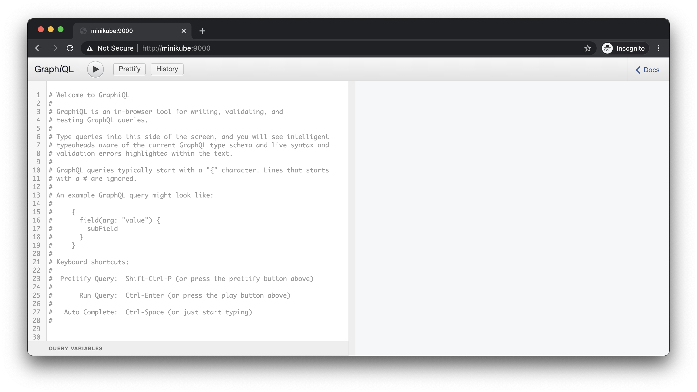

# graphql-python-showcase

### Stop using REST, Post-JSON, and other stuff from 2k00.

## Running

```shell
docker build -t graphql-python-showcase .
docker run --rm -p 9000:9000 graphql-python-showcase
```

Open `http://<your-docker-host>:9000/`.



## Python + GraphQL quick start

* [docs.graphene-python.org/en/latest/quickstart/](https://docs.graphene-python.org/en/latest/quickstart/)
* [www.starlette.io/graphql/](https://www.starlette.io/graphql/)

## Main GraphQL learning resource

* [graphql.org](https://graphql.org/)
* [graphql.org/learn/](https://graphql.org/learn/)

## Free learning resources

* [www.howtographql.com](https://www.howtographql.com)
* [www.graphqlweekly.com](https://www.graphqlweekly.com/)

## Paid learning resources

* [app.pluralsight.com/library/courses/graphql-big-picture/table-of-contents](https://app.pluralsight.com/library/courses/graphql-big-picture/table-of-contents)
* [egghead.io/courses/graphql-query-language](https://egghead.io/courses/graphql-query-language)
* [egghead.io/courses/designing-graphql-schemas-99db](https://egghead.io/courses/designing-graphql-schemas-99db)
* [packtpub.com/application-development/beginning-graphql-elearning](https://www.packtpub.com/application-development/beginning-graphql-elearning)
* [packtpub.com/application-development/practical-graphql-become-graphql-ninja-video](https://www.packtpub.com/application-development/practical-graphql-become-graphql-ninja-video)
* [packtpub.com/web-development/hands-full-stack-web-development-graphql-and-react](https://www.packtpub.com/web-development/hands-full-stack-web-development-graphql-and-react)
